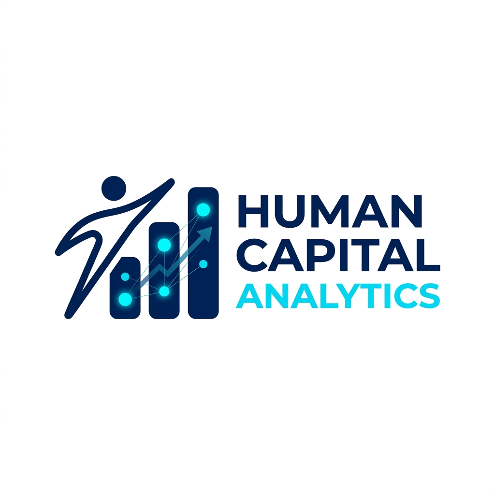
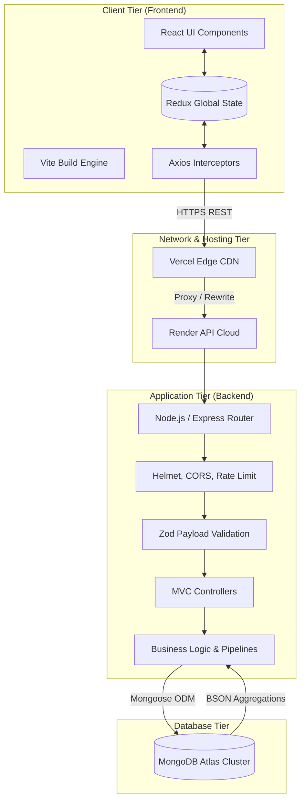
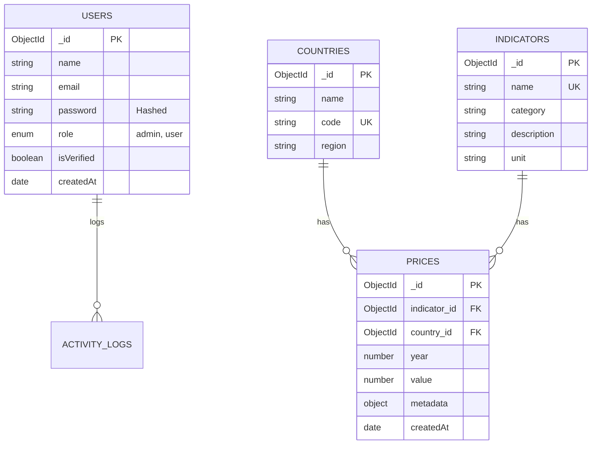

<div align="center">



# 📊 Human Capital Analytics | Full MERN Stack Platform

**Enterprise-Level Dashboard & Predictive Analytics System for Global Economic Intelligence**

[](https://vitejs.dev/)
[](https://reactjs.org/)
[](https://redux.js.org/)
[](https://tailwindcss.com/)
[](https://mui.com/)

[](https://www.mongodb.com/)
[](https://expressjs.com/)
[](https://nodejs.org/)
[](https://documenter.getpostman.com/view/50839186/2sBXqRiGpA)

[Live Demo](https://human-capital-project-sahoo-priyabr.vercel.app/) · [API Documentation](https://documenter.getpostman.com/view/50839186/2sBXqRiGpA) · [Report Bug](https://github.com/priyabratasahoo780/human_capital_project_sahoo_priyabrata/issues) · [Request Feature](https://github.com/priyabratasahoo780/human_capital_project_sahoo_priyabrata/issues)

</div>

---

## 🌍 Project Vision

> _"Empowering global stakeholders with precision-engineered data visualizations and scalable intelligence architectures to decode the complexities of human capital and economic shifts."_

In an era of data-driven decision-making, the **Human Capital Analytics Platform** serves as a high-fidelity lens into the global economy. By processing over **190,000+ real-world records**, this system provides governments, analysts, and enterprises with the tools to visualize inflation trends, consumer price indices, and demographic shifts through a seamless, interactive, and ultra-responsive full-stack experience.

---

## 📖 Introduction

The **Human Capital Analytics MERN Stack Platform** is an enterprise-grade solution that harmonizes a high-performance **Node.js/Express** backend with a sophisticated **React/Vite** frontend. It is architected for speed, security, and massive data handling.

Unlike standard dashboards, this system utilizes complex **MongoDB Aggregation Pipelines** to deliver real-time analytical insights directly to the user's browser. With built-in Role-Based Access Control (RBAC), a feature-driven frontend architecture, and a strictly decoupled MVC backend, it represents the pinnacle of modern full-stack engineering.

---

## 🛠️ Full Tech Stack Architecture

### 💻 Frontend (Client-Side)

| Technology              | Category         | Purpose                                                     |
| :---------------------- | :--------------- | :---------------------------------------------------------- |
| **React.js (Vite)**     | Core Framework   | Ultra-fast development and optimized production builds      |
| **Redux Toolkit**       | State Management | Predictable state container for complex dashboard data      |
| **Tailwind CSS**        | Styling          | Utility-first CSS for rapid, modern UI construction         |
| **Material UI (MUI)**   | UI Components    | Enterprise-grade component library for interactive elements |
| **Recharts / Chart.js** | Visualization    | High-performance dynamic charting and data graphs           |
| **Formik / Yup**        | Form Logic       | Robust form handling and schema-based validation            |

### ⚙️ Backend (Server-Side)

| Technology             | Category            | Purpose                                                 |
| :--------------------- | :------------------ | :------------------------------------------------------ |
| **Node.js**            | Runtime Environment | Scalable, event-driven JavaScript execution             |
| **Express.js**         | Web Framework       | Minimalist and flexible routing and middleware engine   |
| **MongoDB / Mongoose** | Database & ODM      | NoSQL document storage with strict schema modeling      |
| **JWT / Bcrypt**       | Security            | Secure stateless authentication and password encryption |
| **Morgan / Winston**   | Logging             | Production-level request tracking and error logging     |
| **CORS / Helmet**      | Protection          | Cross-origin security and HTTP header hardening         |

---

## ✨ System Features

### 🎨 Frontend Excellence

- **🔐 Multi-Level Auth**: Separate flows for Admin and User roles with persistent sessions.
- **📈 Real-Time Analytics**: Interactive dashboards with filtering, drill-downs, and dynamic scaling.
- **🌓 Theme Orchestration**: Seamless dark/light mode transition via MUI and Tailwind.
- **📱 Ultra-Responsive**: "Mobile-first" design philosophy ensuring clarity across all device formats.
- **🏗️ Feature-Based Architecture**: Modular frontend structure for extreme maintainability.
- **🔔 Smart Notifications**: Context-aware toast alerts for system feedback and error handling.

### 🛡️ Backend Power

- **📊 Aggregation Engine**: Native MongoDB pipelines for high-velocity data crunching.
- **🔍 Dynamic Querying**: Complex filtering, multi-field sorting, and text-search logic.
- **📜 Advanced Pagination**: Cursor and offset-based logic for handling 190k+ records.
- **🛑 Intelligent Rate Limiting**: Protection against API abuse and brute-force attempts.
- **🩺 Health Monitoring**: Real-time status reporting for all infrastructure components.

---

## 🏗️ Comprehensive System Architecture

The platform operates on a tightly integrated **MERN Stack** architecture. It is designed to process high-volume queries with low latency using native MongoDB aggregations, protected by a hardened Express API gateway, and served to the user via a React Single-Page Application (SPA).



---

## 🔄 Complete Application Workflow

The diagram below illustrates the exact lifecycle of a secure, data-intensive request flowing through the entire stack, from the user clicking a button to the database aggregating millions of records.

```mermaid
sequenceDiagram
    participant User
    participant React as React Frontend
    participant Vercel as Edge CDN
    participant API as Express API
    participant DB as MongoDB Atlas

    User->>React: Change Filter (e.g., Select "Inflation")
    React->>React: Dispatch Redux Action
    React->>Vercel: GET /api/v1/stats/trending (Bearer Token)
    Vercel->>API: Proxy Request to Backend
    
    rect rgb(30, 41, 59)
    Note over API: API Security Pipeline
    API->>API: 1. Rate Limit Check
    API->>API: 2. Verify JWT Signature
    API->>API: 3. Verify RBAC Permissions
    API->>API: 4. Sanitize Input & Zod Schema
    end

    API->>DB: Execute Aggregation Pipeline
    DB-->>API: Return Clustered BSON Array
    API-->>Vercel: 200 OK + JSON
    Vercel-->>React: Forward Response Payload
    React->>React: Update Global Redux Store
    React-->>User: Re-render Charts with Animations
```



---

## 📈 Data Analytics & Business Workflow

The system provides a seamless end-to-end data processing workflow for analysts, visualized below:

```mermaid
graph LR
    A[User Auth / Registration] --> B[Dashboard Hub]
    B --> C[Select Economic Indicator]
    C --> D[Geo-filtering / Countries]
    D --> E[Date Range Triggers]
    E --> F[MongoDB Pipeline Aggregation]
    F --> G[Interactive Chart Rendering]
    G --> H[Report Generation]

    classDef default fill:#1e293b,stroke:#475569,stroke-width:1px,color:#f8fafc;
    classDef auth fill:#2563eb,stroke:#1d4ed8,stroke-width:1px,color:#fff;
    classDef filter fill:#8b5cf6,stroke:#7c3aed,stroke-width:1px,color:#fff;
    classDef processing fill:#d97706,stroke:#b45309,stroke-width:1px,color:#fff;
    classDef success fill:#059669,stroke:#047857,stroke-width:1px,color:#fff;

    class A auth;
    class B,C,D,E filter;
    class F processing;
    class G,H success;
```



---

## 📁 Project Structure

### 🖥️ Frontend Architecture

```text
client/
├── public/               # Static assets & SEO files
├── src/
│   ├── components/       # Shared UI components (Atomic design)
│   ├── features/         # Redux Slices (Auth, UI, Data)
│   ├── layouts/          # Page wrappers (AdminLayout, MainLayout)
│   ├── routes/           # Protected & public route definitions
│   ├── store/            # Redux Toolkit global store config
│   ├── hooks/            # Custom reusable React hooks
│   └── services/         # API abstraction layer (Axios instances)
```

### ⚙️ Backend Architecture

```text
server/
├── src/
│   ├── config/           # DB, Passport, and Cloudinary settings
│   ├── controllers/      # Route handler implementations
│   ├── models/           # Mongoose schemas with indexing
│   ├── routes/           # Versioned API route definitions (v1/v2)
│   ├── middlewares/      # Error, Auth, and Log middlewares
│   ├── validators/       # Input validation schemas (Joi/Zod)
│   └── app.js            # Express instance configuration
```

---

## ⚙️ Installation & Setup

Follow these structured steps to bootstrap your local development environment:

<table style="border: none; background: transparent; width: 100%; border-collapse: collapse;">
  <tr style="border: none; background: transparent;">
    <td style="border: none; vertical-align: top; padding: 16px 0;">
      <h3 style="margin-top: 0; color: #ff6038;">1️⃣ Repository Setup</h3>
      <p style="margin-bottom: 8px;">Clone the enterprise repository and navigate into the workspace root:</p>
      <pre><code class="language-bash">git clone https://github.com/priyabratasahoo780/human_capital_project_sahoo_priyabrata.git
cd human_capital_project_sahoo_priyabrata</code></pre>
    </td>
  </tr>
  <tr style="border: none; background: transparent;">
    <td style="border: none; vertical-align: top; padding: 16px 0;">
      <h3 style="margin-top: 0; color: #ff6038;">2️⃣ Backend Configuration</h3>
      <p style="margin-bottom: 8px;">Navigate to the <code>backend/</code> directory, install core server dependencies, populate your environment variables, and run the development listener:</p>
      <pre><code class="language-bash">cd backend
npm install
cp .env.example .env
# Configure MONGODB_URI & JWT_SECRET inside .env
npm run dev</code></pre>
    </td>
  </tr>
  <tr style="border: none; background: transparent;">
    <td style="border: none; vertical-align: top; padding: 16px 0;">
      <h3 style="margin-top: 0; color: #ff6038;">3️⃣ Frontend Configuration</h3>
      <p style="margin-bottom: 8px;">In a parallel terminal session, navigate to the <code>frontend/</code> directory, install UI package modules, copy the client variables, and boot Vite:</p>
      <pre><code class="language-bash">cd ../frontend
npm install
cp .env.example .env
# Configure VITE_API_URL inside .env
npm run dev</code></pre>
    </td>
  </tr>
</table>

---

## 🔑 Environment Variables & Configurations

Configure the `.env` settings inside their respective root directories to successfully bind the client and server engines.

### 🔒 Backend Environment Setup (`backend/.env`)

| Variable | Type | Description | Default / Example |
| :--- | :--- | :--- | :--- |
| `NODE_ENV` | String | Active system state | `development` |
| `PORT` | Number | Active listening port for Express | `5000` |
| `MONGODB_URI` | String | MongoDB Atlas Cloud URL string | `mongodb+srv://...` |
| `LOCAL_MONGODB_URI` | String | Fallback connection string for local servers | `mongodb://127.0.0.1:27017/humanCapitalDB` |
| `JWT_SECRET` | String | Encryption token hash for user authentication | `super_secret_jwt_key_for_human_capital_api_2026` |
| `JWT_EXPIRES_IN` | String | Lifespan of signed credentials | `15m` |

### 🌐 Frontend Environment Setup (`frontend/.env`)

| Variable | Type | Description | Default / Example |
| :--- | :--- | :--- | :--- |
| `VITE_API_URL` | String | Backend REST API endpoint pointer | `http://localhost:5000/api/v1` |
| `VITE_APP_NAME` | String | SEO platform identity and brand name | `"Human Capital Analytics"` |

---

## 🗄️ Database Design & Entity Relationship Diagram

The platform utilizes a highly normalized, scalable MongoDB schema design enforced via Mongoose, ensuring data integrity across users, countries, indicators, and hundreds of thousands of price records.



### 📈 Price Analysis Compound Indexing

To handle 190,000+ records at scale, the database utilizes advanced compound indexing on the `Prices` collection for `O(log n)` query speeds:
```javascript
// Optimized for analytical timeline lookups
priceSchema.index({ country: 1, year: -1 });

// Optimized for indicator distribution
priceSchema.index({ indicator: 1, country: 1 });
```

---

## 🚀 API Documentation & Interactive Testing

To facilitate seamless integration and testing, a comprehensive Postman collection has been published. This documentation includes detailed request/response schemas, authentication requirements, and example use cases for every endpoint.

<div align="center">

### 📂 [Explore the Interactive API Collection on Postman](https://documenter.getpostman.com/view/50839186/2sBXqRiGpA)

[](https://documenter.getpostman.com/view/50839186/2sBXqRiGpA)
[](https://documenter.getpostman.com/view/50839186/2sBXqRiGpA)

</div>

---

## 📡 API Endpoints

### 🔐 Authentication APIs

| Method  | Endpoint                             | Description                        | Access |
| :------ | :----------------------------------- | :--------------------------------- | :----- |
| `POST`  | `/api/v1/auth/register`              | Create a new enterprise account    | Public |
| `POST`  | `/api/v1/auth/login`                 | Authenticate user and return JWT   | Public |
| `POST`  | `/api/v1/auth/logout`                | Invalidate current session         | User   |
| `POST`  | `/api/v1/auth/forgot-password`       | Request password reset link        | Public |
| `PATCH` | `/api/v1/auth/reset-password/:token` | Set new password with token        | Public |
| `POST`  | `/api/v1/auth/refresh-token`         | Renew expired access tokens        | User   |
| `GET`   | `/api/v1/auth/me`                    | Retrieve current user profile      | User   |
| `POST`  | `/api/v1/auth/send-otp`              | Trigger OTP for 2FA/Verification   | User   |
| `POST`  | `/api/v1/auth/verify-otp`            | Validate multi-factor OTP code     | User   |
| `PATCH` | `/api/v1/auth/change-password`       | Update password for logged-in user | User   |

---

### 📦 Prices APIs

| Method   | Endpoint                    | Description                               | Access |
| :------- | :-------------------------- | :---------------------------------------- | :----- |
| `GET`    | `/api/v1/prices`            | Fetch all records with full query support | User   |
| `GET`    | `/api/v1/prices/:id`        | Get detailed view of a single record      | User   |
| `POST`   | `/api/v1/prices`            | Manually insert a new price record        | Admin  |
| `PATCH`  | `/api/v1/prices/:id`        | Update existing price data                | Admin  |
| `DELETE` | `/api/v1/prices/:id`        | Permanent removal of a record             | Admin  |
| `GET`    | `/api/v1/prices/latest`     | Retrieve most recent data entries         | User   |
| `GET`    | `/api/v1/prices/trending`   | List records with highest volatility      | User   |
| `GET`    | `/api/v1/prices/random`     | Get a randomized sample of data           | User   |
| `GET`    | `/api/v1/prices/high-value` | Filter records with top-tier values       | User   |
| `GET`    | `/api/v1/prices/low-value`  | Filter records with bottom-tier values    | User   |

---

### 🌍 Country APIs

| Method | Endpoint                          | Description                          | Access |
| :----- | :-------------------------------- | :----------------------------------- | :----- |
| `GET`  | `/api/v1/countries`               | List all unique countries in dataset | User   |
| `GET`  | `/api/v1/countries/search`        | Search countries by name or code     | User   |
| `GET`  | `/api/v1/countries/:code/stats`   | Macro-economic stats for a country   | User   |
| `GET`  | `/api/v1/countries/:code/history` | Historical price trends by nation    | User   |

---

### 📊 Statistics & Analytics APIs

| Method | Endpoint                       | Description                          | Access |
| :----- | :----------------------------- | :----------------------------------- | :----- |
| `GET`  | `/api/v1/stats/prices`         | General price statistics overview    | User   |
| `GET`  | `/api/v1/stats/highest`        | Global record-high values            | User   |
| `GET`  | `/api/v1/stats/lowest`         | Global record-low values             | User   |
| `GET`  | `/api/v1/stats/monthly-avg`    | Averages grouped by month            | User   |
| `GET`  | `/api/v1/stats/yearly-avg`     | Averages grouped by year             | User   |
| `GET`  | `/api/v1/stats/top-countries`  | Leading countries by indicator value | User   |
| `GET`  | `/api/v1/stats/top-indicators` | Most tracked global indicators       | User   |
| `GET`  | `/api/v1/stats/trending`       | Analytics on trending categories     | User   |
| `GET`  | `/api/v1/stats/count`          | Total record count analytics         | User   |
| `GET`  | `/api/v1/stats/distribution`   | Value distribution frequency data    | User   |

---

### 🔍 Search & Filtering APIs

| Method | Endpoint                       | Description                          | Access |
| :----- | :----------------------------- | :----------------------------------- | :----- |
| `GET`  | `/api/v1/search/prices`        | Text-based search across indicators  | User   |
| `GET`  | `/api/v1/search/countries`     | Optimized country search engine      | User   |
| `GET`  | `/api/v1/search/indicators`    | Indicator name search functionality  | User   |
| `GET`  | `/api/v1/filter/year/:year`    | Quick filter for specific years      | User   |
| `GET`  | `/api/v1/filter/month/:month`  | Quick filter for specific months     | User   |
| `GET`  | `/api/v1/filter/country/:code` | Quick filter for specific countries  | User   |
| `GET`  | `/api/v1/filter/indicator/:id` | Quick filter for specific indicators | User   |
| `GET`  | `/api/v1/filter/range`         | Filter by numeric value ranges       | User   |
| `GET`  | `/api/v1/query/advanced`       | Combined multi-parameter query API   | User   |

---

### 🛡 Protected APIs

| Method | Endpoint                      | Description                     | Access  |
| :----- | :---------------------------- | :------------------------------ | :------ |
| `GET`  | `/api/v1/protected/dashboard` | Secured dashboard data overview | Private |
| `GET`  | `/api/v1/protected/prices`    | Premium price data access       | Private |
| `GET`  | `/api/v1/protected/profile`   | Detailed JWT-protected profile  | Private |
| `GET`  | `/api/v1/protected/admin`     | Admin-only system status        | Admin   |
| `GET`  | `/api/v1/protected/user`      | Standard user-only data portal  | User    |
| `GET`  | `/api/v1/auth/verify-role`    | Backend role verification check | Private |

---

### ⚙️ Admin APIs

| Method | Endpoint                   | Description                         | Access |
| :----- | :------------------------- | :---------------------------------- | :----- |
| `GET`  | `/api/v1/admin/dashboard`  | Global system administration stats  | Admin  |
| `GET`  | `/api/v1/admin/statistics` | User activity and platform metrics  | Admin  |
| `GET`  | `/api/v1/admin/prices`     | Bulk management of price records    | Admin  |
| `GET`  | `/api/v1/admin/analytics`  | Highly sensitive platform analytics | Admin  |

---

### 🧠 Aggregation APIs

| Method | Endpoint                          | Description                         | Access  |
| :----- | :-------------------------------- | :---------------------------------- | :------ |
| `GET`  | `/api/v1/aggregate/top-countries` | Pipeline: Geo-economic clustering   | Private |
| `GET`  | `/api/v1/aggregate/yearly-trends` | Pipeline: Time-series trend mapping | Private |
| `GET`  | `/api/v1/aggregate/monthly`       | Pipeline: Seasonality analytics     | Private |
| `GET`  | `/api/v1/aggregate/distribution`  | Pipeline: Advanced data spread      | Private |
| `GET`  | `/api/v1/aggregate/reports`       | Pipeline: Comprehensive reports     | Private |

---

### ❤️ Health & Monitoring APIs

| Method | Endpoint          | Description                        | Access |
| :----- | :---------------- | :--------------------------------- | :----- |
| `GET`  | `/api/v1/health`  | Service uptime and status check    | Public |
| `GET`  | `/api/v1/metrics` | Real-time performance metrics      | Admin  |
| `GET`  | `/api/v1/status`  | DB and Redis connectivity status   | Public |
| `GET`  | `/api/v1/version` | Current API version and build info | Public |

---

## ⚡ Performance Optimization

- **DB Indexing**: Utilizing B-tree indexes for `O(log n)` lookup performance on 190k+ records.
- **Lean Queries**: Using `.lean()` to bypass Mongoose document hydration where possible.
- **Lazy Loading**: React components and routes are code-split via `React.lazy()` and `Suspense`.
- **Memoization**: Heavy analytical calculations optimized using `useMemo` and `useCallback` to prevent unnecessary re-renders.
- **Pagination & Virtualization**: Only fetching and rendering data relevant to the current viewport.

---

## 🛡️ Authentication & Security Flow

1. **Client**: Submits credentials -> `POST /login`.
2. **Server**: Validates with Bcrypt -> Issues signed JWT.
3. **Client**: Stores token (HTTPOnly Cookie or Secured Redux State).
4. **Server**: `protect` middleware decodes token and injects `req.user`.
5. **Authorization**: `restrictTo('admin')` middleware validates roles before allowing execution.

---

## 🎨 UI / UX Design System

The platform uses a unified design language centered around **clarity** and **efficiency**:

- **Neumorphism Design System**: Deep 3D styling combined with Material-UI and Tailwind for an ultra-modern aesthetic.
- **Sidebar Navigation**: Collapsible, responsive navigation for deep module access.
- **Data Tables**: Feature-rich grids with sorting, filtering, and backend pagination.
- **Skeleton Loaders**: Custom skeletons providing smooth visual transitions during data fetching.
- **Empty States**: Professional illustrations for scenarios with no data matches.

---

## 📱 SEO Optimization

Utilizing **React Helmet** for dynamic meta-management:

- **Meta Tags**: Page-specific titles and descriptions for search engine indexing.
- **Open Graph**: Rich social media sharing previews.
- **Canonical Links**: Preventing duplicate content penalties.

---

## 💻 API Usage Examples

### Fetching Analytics with Axios (Redux Thunk)

```javascript
export const fetchStats = createAsyncThunk("stats/fetch", async () => {
  const response = await axios.get("/stats/summary", {
    params: { year: 2023, country: "USA" },
  });
  return response.data;
});
```

### Advanced Query (cURL)

```bash
curl -H "Authorization: Bearer <TOKEN>" \
     "https://api.example.com/v1/prices?sort=-value&limit=10&indicator=CPI"
```

---

## ☁️ Deployment

| Platform    | Role               | Command                     |
| :---------- | :----------------- | :-------------------------- |
| **Vercel**  | Frontend Hosting   | `npm run build`             |
| **Railway** | Backend / Database | `npm start`                 |
| **Docker**  | Containerization   | `docker-compose up --build` |

---

## 🔮 Future Enhancements

- **🤖 AI Predictions**: Integrated ML models to forecast inflation trends based on historical data.
- **🌐 Multi-Language**: Full i18n support for global reach.
- **📲 PWA Integration**: Desktop-class mobile experience with offline capabilities.
- **🔔 Real-time Alerts**: Socket.io integration for threshold-based economic triggers.

---

## 🤝 Contributing

<p align="center">
  Contributions are what make the open-source community such an amazing place to learn, inspire, and create. Any contributions you make are <strong>greatly appreciated</strong>.
</p>

<p align="center">
  <a href="https://github.com/priyabratasahoo780/human_capital_project_sahoo_priyabrata/fork"></a>
  &nbsp;&nbsp;
  <a href="https://github.com/priyabratasahoo780/human_capital_project_sahoo_priyabrata/issues"></a>
  &nbsp;&nbsp;
  <a href="https://github.com/priyabratasahoo780/human_capital_project_sahoo_priyabrata/issues"></a>
</p>

---

## 📜 License

Distributed under the **MIT License**. See [LICENSE](file:///c:/Users/priyabrata/Desktop/Human_Capital/human_capital_project_sahoo_priyabrata/LICENSE) for more details.

<p align="left">
  <a href="https://opensource.org/licenses/MIT">
    
  </a>
</p>

---

## 👨‍💻 Developer & Author

<table align="center" style="border: none; background: transparent; border-collapse: collapse;">
  <tr style="background: transparent; border: none;">
    <td align="center" style="border: none; padding: 24px;">
      <a href="https://github.com/priyabratasahoo780">
        
      </a>
      <br /><br />
      <strong style="font-size: 1.25rem; color: #f8fafc;">Priyabrata Sahoo</strong>
      <br />
      <span style="color: #94a3b8; font-size: 0.95rem;">Full-Stack Software Engineer & Platform Architect</span>
    </td>
  </tr>
  <tr style="background: transparent; border: none;">
    <td align="center" style="border: none; padding-bottom: 24px;">
      <a href="https://github.com/priyabratasahoo780" target="_blank">
        
      </a>
      &nbsp;&nbsp;
      <a href="https://www.linkedin.com/in/priyabrata-sahoo/" target="_blank">
        
      </a>
    </td>
  </tr>
</table>

---

<div align="center">

<h3>🚀 Deciphering the world's data, one record at a time.</h3>

<br />

<a href="#-human-capital-analytics--full-mern-stack-platform">
  
</a>

</div>
