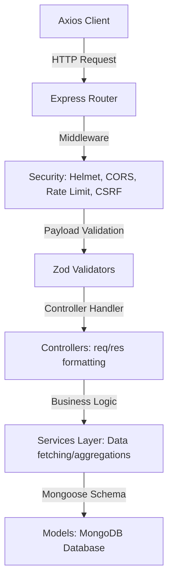

<div align="center">


# ⚙️ Human Capital Analytics | Backend Engine

**High-Performance MERN RESTful API, Advanced Aggregations & Security Orchestration Gateway**

[](https://nodejs.org/)
[](https://expressjs.com/)
[](https://www.mongodb.com/)
[](https://jwt.io/)
[](https://zod.dev/)
[](https://documenter.getpostman.com/view/50839186/2sBXqRiGpA)

<br/>

[](https://human-capital-project-sahoo-priyabrata.onrender.com)

> A strictly decoupled, enterprise-grade MVC backend engine built to deliver lightning-fast analytics over 190,000+ consumer price records using MongoDB Aggregation Pipelines and a hardened multi-layer defense system.

---

</div>

## 🎯 Architectural Blueprint & Core Design

The backend uses a strictly decoupled **MVC (Model-View-Controller) / Service** architecture, enforcing strict Separation of Concerns (SoC):



### Key Engineering Features:
*   **📊 Native Aggregation Engine**: Dynamic pipelines calculating global macro-economic statistics, monthly averages, yearly trends, and geo-economic clustering.
*   **🛡️ Multi-Layer Security Controls**: Hardened with Helmet HTTP headers, CORS whitelisting, HTTP Parameter Pollution (`hpp`) defense, Custom NoSQL query injection sanitizers, and Rate-limiting.
*   **✅ Strict Payload Sanitization**: Fully typed runtime payload schema enforcement using **Zod** validator schemas.
*   **🛠️ Service-Oriented Logic**: Controllers only manage HTTP protocols (`req`, `res`, `cookies`). Core database operations and business logic are delegated to independent services.

---

## 🗄️ Database Models & Indexing Strategy

We utilize **Mongoose** for schema definition, dynamic validations, and compound indexing:

### 1. `User` Schema (`models/user.model.js`)
Handles system profiles, authentication credentials, and session tracking:
*   `name`: String, required, trimmed.
*   `email`: String, required, lowercase, unique, regex format validation.
*   `password`: String, selected false by default to prevent accidental leaks.
*   `role`: Enum (`'user'`, `'admin'`), defaults to `'user'`.
*   `isVerified`: Boolean, defaults to `false`.
*   **Middleware Hook**: Pre-save password hashing using `bcryptjs` (salt factor 10).

### 2. `Price` Schema (`models/price.model.js`)
Houses consumer price records and index valuations:
*   `indicator`: String, required, indexed (B-tree).
*   `country`: String, required, indexed (B-tree).
*   `year`: Number, required.
*   `value`: Number, required.
*   `metadata`: Object mapping `source` (String) and `reliability` (Number).
*   **Compound Indexes**: Optimized for rapid analytical filters:
    ```javascript
    priceSchema.index({ country: 1, year: -1 });
    priceSchema.index({ indicator: 1, country: 1 });
    ```

### 3. `Country` Schema (`models/country.model.js`)
Reference details for geo-economic boundaries:
*   `name`: String, required, unique.
*   `code`: String, required, unique, uppercase (ISO standards).
*   `region`: String, required.

---

## 📊 Advanced MongoDB Aggregation Pipelines

Heavy statistical calculations are computed directly on the database engine using aggregation pipelines:

### 📅 Yearly Trend Pipelines
Used to map multi-year time-series indexes grouped by indicators and nations:
```javascript
[
  { $match: { country: countryCode, indicator: indicatorId } },
  {
    $group: {
      _id: "$year",
      averageValue: { $avg: "$value" },
      minVal: { $min: "$value" },
      maxVal: { $max: "$value" },
      count: { $sum: 1 }
    }
  },
  { $sort: { _id: 1 } },
  {
    $project: {
      year: "$_id",
      averageValue: 1,
      minVal: 1,
      maxVal: 1,
      count: 1,
      _id: 0
    }
  }
]
```

### 🌍 Geo-Clustering & Distribution Pipelines
Segments values into frequency buckets to build client distribution curves:
```javascript
[
  { $match: { indicator: indicatorId } },
  {
    $bucketAuto: {
      groupBy: "$value",
      buckets: 10,
      output: {
        count: { $sum: 1 },
        average: { $avg: "$value" }
      }
    }
  }
]
```

---

## 🛡️ Multi-Layer Security Architecture

### 🛑 Global API Rate Limiting (`middlewares/rateLimit.middleware.js`)
Configures express-rate-limit profiles to safeguard resources against DDoS:
*   **Authentication API Route**: Restricted to a maximum of `15 requests per 15 minutes` per IP address.
*   **Data Aggregation Routes**: Restricted to `100 requests per 15 minutes` per IP address.
*   **Import Route**: Rate limited to `5 requests per minute` to prevent CPU exhaustion.

### 🧹 Custom Payload Sanitizer (`utils/sanitizeData.js`)
An express interceptor that recursively sanitizes request queries/params/body:
*   Prevents MongoDB query injection by stripping out keys starting with `$` or `.` (NoSQL Sanitization).
*   Recursively trims whitespaces from incoming string payloads.

---

## 🚨 Error Handling Pipeline

The application features a centralized, synchronous-asynchronous error management engine:

### 1. `AppError` Utility Class
Extends JavaScript's native `Error` to append HTTP status codes and label errors as operational:
```javascript
class AppError extends Error {
  constructor(message, statusCode) {
    super(message);
    this.statusCode = statusCode;
    this.status = `${statusCode}`.startsWith('4') ? 'fail' : 'error';
    this.isOperational = true; // Operational failures (e.g. invalid inputs)
    Error.captureStackTrace(this, this.constructor);
  }
}
```

### 2. Global Error Handling Middleware (`middlewares/error.middleware.js`)
Intercepts thrown errors and formats clean response envelopes. It catches standard database failures and transforms them into operational HTTP errors:
*   **Mongoose Duplicate Key (11000)** $\rightarrow$ `400 Bad Request` ("Email is already registered").
*   **Mongoose Validation Error** $\rightarrow$ `400 Bad Request` (collects individual validation messages).
*   **JsonWebTokenError** $\rightarrow$ `401 Unauthorized` ("Invalid token. Please log in again.").
*   **TokenExpiredError** $\rightarrow$ `401 Unauthorized` ("Your token has expired. Please log in again.").

---

## ✅ Request Validation Pipeline (Zod Schemas)

All inputs (`req.body`, `req.query`, `req.params`) are validated prior to controller routing. Example schemas inside `/validators`:

```javascript
const { z } = require("zod");

// Register validation schema
const registerSchema = z.object({
  name: z.string().min(2, "Name must be at least 2 characters long"),
  email: z.string().email("Please provide a valid email format"),
  password: z.string()
    .min(8, "Password must be at least 8 characters long")
    .regex(/[a-z]/, "Password must contain at least one lowercase letter")
    .regex(/[A-Z]/, "Password must contain at least one uppercase letter")
    .regex(/[0-9]/, "Password must contain at least one number"),
  role: z.enum(["user", "admin"]).optional(),
});
```

---

## 📐 Strict Codebase Guidelines

To ensure code maintainability, this project enforces these development principles:

### 1️⃣ The 250-Line limit
*   **Mandatory Rule**: No controller, service, validator, or route file may exceed **250 lines of code**.
*   **Decomposition**: If files grow beyond this limit, developers must split them by extracting helper functions, utilities, or specific domain sub-handlers into separate files.

### 2️⃣ Lean Database Interfacing
*   **Optimization**: Use Mongoose `.lean()` on read-only queries to avoid expensive hydration overhead.
*   **Indexing**: Compound indices are strategically created (e.g., `{ country: 1, year: -1 }`) to keep read queries performing in `O(log n)`.

---

## 📂 System File Hierarchy

```text
backend/
├── ⚙️ config/                 # Database connectors and global infrastructure setups
├── 🎮 controllers/            # Route handler logic mapping HTTP queries to service calls
├── 🛡️ middlewares/            # Request parsing filters (JWT validation, RBAC, Errors)
├── 📦 models/                 # Mongoose schemas with compound indexes & pre-save hooks
├── 🛣️ routes/                 # Express versioned api endpoints (/api/v1)
├── 🛠️ services/               # Reusable core analytical algorithms and DB query handlers
├── 🔧 utils/                  # Helper utilities (Token generators, JSON formatters)
├── ✅ validators/             # Zod input schemas enforcing strict data validation
├── 🚀 app.js                  # Global Express app definition with security middleware
└── 🏁 server.js               # Application entry point hosting the HTTP listener
```

---

## 📡 API Endpoint Architecture

### 🔐 Authentication (`/api/v1/auth`)
*   `POST /register` - Creates a new user profile.
*   `POST /login` - Validates credentials, issues JWT and sets secure HTTP cookie.
*   `POST /logout` - Invalidate active server session.
*   `POST /send-otp` / `POST /verify-otp` - OTP verification pipeline for security operations.
*   `PATCH /change-password` - Centralized password update pipeline.

### 📊 Prices Data Grid (`/api/v1/prices`)
*   `GET /` - Fetches economic records supporting cursor pagination, advanced sorting, and query filters.
*   `GET /:id` - Fetches a single price record details.
*   `POST /` / `PATCH /:id` / `DELETE /:id` - Admin-restricted CRUD operations.
*   `GET /trending` - Lists volatile price movements.

### 🌍 Territories & Countries (`/api/v1/countries`)
*   `GET /` - Retrieves a list of unique countries.
*   `GET /search` - Searches specific countries by name.
*   `GET /:code/stats` - Pulls historical macroeconomic data points for a specific country.

### 📈 Analytics & Aggregations (`/api/v1/stats`)
*   `GET /prices` - Aggregated statistics summaries.
*   `GET /monthly-avg` - Native MongoDB aggregation pipeline calculating indices grouped by month.
*   `GET /yearly-avg` - Aggregated historical index averages grouped by calendar year.
*   `GET /distribution` - Returns frequency distributions of index ranges.

### 🧠 System Diagnostics (`/api/v1/health`)
*   `GET /` - Returns uptime, microservice status checks, and DB connection readiness.

---

## ⚡ Quick Start Guide

### 1️⃣ Install Dependencies
Ensure you have Node.js v20+ installed. Run the command at the root of the backend directory:
```bash
npm install
```

### 2️⃣ Configure Environment Variables
Duplicate `.env.example` to `.env` and configure credentials:
```env
PORT=5000
NODE_ENV=development

# Database configuration
LOCAL_MONGODB_URI=mongodb://127.0.0.1:27017/humanCapitalDB
MONGODB_URI=mongodb+srv://<user>:<password>@cluster0.mongodb.net/human_capital_analytics

# JWT authentication
JWT_SECRET=super_secret_jwt_key_for_human_capital_api_2026
JWT_EXPIRES_IN=15m
```

### 3️⃣ Start Development Server
Boots Node with Nodemon for hot reloading:
```bash
npm run dev
```

---

## 🕹️ Command Reference

| Command | Environment | Purpose |
| :--- | :--- | :--- |
| `npm start` | **Production** | Runs the compiled production code. |
| `npm run dev` | **Development** | Runs the development listener via Nodemon. |
| `npm run lint` | **Quality** | Runs ESLint analysis over `/src`. |
| `npm run format` | **Quality** | Formats code layout using Prettier. |
| `npm run test` | **Testing** | Runs Jest unit and integration tests. |

---

<div align="center">

### 📖 Interactive Testing & Complete API Reference
[](https://documenter.getpostman.com/view/50839186/2sBXqRiGpA)

---

## 📜 License

Distributed under the **MIT License**. See [LICENSE](file:///c:/Users/priyabrata/Desktop/Human_Capital/human_capital_project_sahoo_priyabrata/LICENSE) for more details.

<p align="left">
  <a href="https://opensource.org/licenses/MIT">
    
  </a>
</p>

---

## 👨‍💻 Developer & Author

<table align="center" style="border: none; background: transparent; border-collapse: collapse;">
  <tr style="background: transparent; border: none;">
    <td align="center" style="border: none; padding: 24px;">
      <a href="https://github.com/priyabratasahoo780">
        
      </a>
      <br /><br />
      <strong style="font-size: 1.25rem; color: #f8fafc;">Priyabrata Sahoo</strong>
      <br />
      <span style="color: #94a3b8; font-size: 0.95rem;">Full-Stack Software Engineer & Platform Architect</span>
    </td>
  </tr>
  <tr style="background: transparent; border: none;">
    <td align="center" style="border: none; padding-bottom: 24px;">
      <a href="https://github.com/priyabratasahoo780" target="_blank">
        
      </a>
      &nbsp;&nbsp;
      <a href="https://www.linkedin.com/in/priyabrata-sahoo/" target="_blank">
        
      </a>
    </td>
  </tr>
</table>

---

<div align="center">

<h3>🚀 Deciphering global datasets securely with low-latency APIs.</h3>

<br />

<a href="#-human-capital-analytics--backend-engine">
  
</a>

</div>
