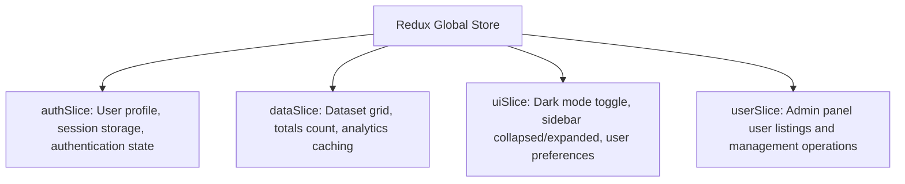

<div align="center">


# 📊 Human Capital Analytics | Client Application

**Enterprise-Grade React Dashboard, Real-Time Charting & Advanced Economics Analytics Platform**

[](https://react.dev/)
[](https://vite.dev/)
[](https://mui.com/)
[](https://tailwindcss.com/)
[](https://redux-toolkit.js.org/)
[](https://framer.com/motion/)

> A highly performant client-side application designed to visualize consumer price indices, inflation trends, and macro-economic factors utilizing interactive charting, advanced filtering, and a state-of-the-art Glassmorphic & Neumorphic design system.

---

</div>

## 🌌 System Capabilities

This application acts as a secure control center for analyzing global economic intelligence. Key client-side modules include:

*   **🔐 Enterprise Authentication**: Safe session management utilizing JWT Access tokens, secure HTTP-only cookies, and client-side route guards supporting multi-level Role-Based Access Control (RBAC).
*   **📈 Dashboard Viewports**: Real-time KPI summaries (e.g. tracking indicators, country counts, user base volume) integrated with interactive charts for economic indicators.
*   **📊 Dynamic Data Explorer**: Deep search and paginated data tables featuring server-side pagination, multi-column sorting, and complex category filtering.
*   **🗺️ Country Profiles**: Dedicated geo-economic tabs containing historical index trends, growth indices, and comparative analytics.
*   **⚙️ Platform Configuration**: Responsive panel for adjusting credentials, active browser session tracking, and user profile management.

---

## 🎨 Design System & Custom Components

The visual framework blends **Tailwind CSS** with **Material-UI (MUI)** to construct dark/light themes featuring Neumorphic elements:

### 1. Unified Theme Context (`context/ThemeContext.jsx`)
React context coordinates state between Redux UI settings and the HTML root element class list:
*   **Tailwind Mode**: Synchronizes `.dark` or `.light` selector state on the HTML root element:
    ```javascript
    useEffect(() => {
      const root = window.document.documentElement;
      root.classList.remove('light', 'dark');
      root.classList.add(themeMode);
    }, [themeMode]);
    ```
*   **MUI Integration**: Injectable palettes that style text fields, panels, paper sheets, and modals dynamically depending on active state.

### 2. Micro-Interactions & Transitions
*   **Framer Motion**: Smooth spring animations (`type: "spring", stiffness: 120`) wrapping navigation transitions, cards, lists, and modal overlays to prevent layout shifts.
*   **Tactile Feedback**: Active neumorphic borders (`0 0 10px rgba(99,102,241,0.8)`) applied to status cards.

---

## 🧠 Central State Management (Redux Store)

We use **Redux Toolkit** to handle UI state, cached datasets, and server responses in a predictable single-source-of-truth container:



### Slice Breakdowns & Key Thunks:
*   `authSlice.js` $\rightarrow$ Manages user sessions. Includes `loginUser` (submits credentials, updates LocalStorage, and stores cookies) and `fetchCurrentUser` (queries profile endpoint).
*   `dataSlice.js` $\rightarrow$ Manages data tables. Handles `fetchDataset` (coordinates sorting parameters, searches, pagination numbers) and CRUD actions (`createPrice`, `updatePrice`, `deletePrice`).
*   `uiSlice.js` $\rightarrow$ Coordinates visual states like `sidebarOpen`, theme preferences, and telemetry indicators.

---

## 🛡️ Input Validation & Form Libraries

Forms are powered by **Formik** and validated client-side with **Yup** schemas to catch invalid entries before hitting API controllers:

<table style="border: none; background: transparent; width: 100%; border-collapse: collapse;">
  <tr style="border: none; background: transparent;">
    <td width="40%" style="border: none; vertical-align: top; padding: 12px 16px 12px 0;">
      <h4 style="color: #ff6038; margin-top: 0;">Validation Criteria</h4>
      <ul style="padding-left: 20px; color: #94a3b8; font-size: 0.92rem;">
        <li><strong>Name</strong>: Minimum 2 characters, required.</li>
        <li><strong>Email</strong>: Valid format structure, required.</li>
        <li><strong>Password</strong>: Minimum 8 characters, must contain at least 1 lowercase letter, 1 uppercase letter, and 1 number.</li>
      </ul>
    </td>
    <td width="60%" style="border: none; vertical-align: top; padding: 12px 0;">
      <pre><code class="language-javascript">import * as Yup from 'yup';

const validationSchema = Yup.object({
  name: Yup.string()
    .min(2, 'Name must be at least 2 characters')
    .required('Name is required'),
  email: Yup.string()
    .email('Enter a valid email')
    .required('Email is required'),
  password: Yup.string()
    .min(8, 'Password must be at least 8 characters')
    .matches(/[a-z]/, 'Password must contain a lowercase letter')
    .matches(/[A-Z]/, 'Password must contain an uppercase letter')
    .matches(/[0-9]/, 'Password must contain a number')
    .required('Password is required'),
});</code></pre>
    </td>
  </tr>
</table>

---

## 🎣 Custom React Hooks

### 🔌 `useFetch` Hook (`hooks/useFetch.js`)

An abstraction utility for read-only HTTP GET requests. It automates query state handling and interfaces directly with our custom Axios configuration:

```javascript
const { data, loading, error, refetch } = useFetch('/stats/distribution');
```

<div style="background-color: rgba(255,255,255,0.02); border-left: 4px solid #ff6038; padding: 14px 18px; border-radius: 6px; margin: 12px 0;">
  <strong style="color: #f8fafc; font-size: 0.95rem;">💡 State Hook Variables:</strong>
  <ul style="margin: 6px 0 0 0; padding-left: 20px; color: #94a3b8; font-size: 0.92rem; line-height: 1.5;">
    <li><code>data</code>: Stores the parsed backend JSON response payload.</li>
    <li><code>loading</code>: Boolean flag representing active network transactions.</li>
    <li><code>error</code>: String message populated on network failures or bad server status responses.</li>
    <li><code>refetch()</code>: Function to manually trigger database queries (e.g. reload or retry).</li>
  </ul>
</div>

---

## 🛡️ Token Lifecycle & Network Interceptor

The client application abstracts token management inside `services/api.js` using a visual lifecycle pipeline:

<table style="border: none; background: transparent; width: 100%; border-collapse: collapse;">
  <tr style="border: none; background: transparent;">
    <td style="border: none; padding: 12px 0;">
      <div style="display: flex; align-items: flex-start; gap: 12px; margin-bottom: 16px;">
        <div style="background: #2563eb; color: #fff; width: 28px; height: 28px; border-radius: 50%; display: flex; align-items: center; justify-content: center; font-weight: bold; flex-shrink: 0;">1</div>
        <div>
          <strong style="color: #f8fafc; font-size: 0.98rem;">Bearer Token Injection (Request Interceptor)</strong>
          <p style="color: #94a3b8; font-size: 0.9rem; margin: 4px 0 8px 0;">Scans local storage cache for active user tokens on every outgoing endpoint request and appends standard credentials header:</p>
          <pre><code class="language-javascript">config.headers.Authorization = `Bearer ${token}`;</code></pre>
        </div>
      </div>
      <div style="display: flex; align-items: flex-start; gap: 12px; margin-bottom: 16px;">
        <div style="background: #059669; color: #fff; width: 28px; height: 28px; border-radius: 50%; display: flex; align-items: center; justify-content: center; font-weight: bold; flex-shrink: 0;">2</div>
        <div>
          <strong style="color: #f8fafc; font-size: 0.98rem;">Exponential Backoff Retry Pipeline (Response Interceptor)</strong>
          <p style="color: #94a3b8; font-size: 0.9rem; margin: 4px 0 0 0;">When queries fail due to network timeouts or server outages (5xx status codes), the client executes up to <strong>2 retries</strong> with progressive backoffs (1s, then 2s) before reporting failures.</p>
        </div>
      </div>
      <div style="display: flex; align-items: flex-start; gap: 12px;">
        <div style="background: #dc2626; color: #fff; width: 28px; height: 28px; border-radius: 50%; display: flex; align-items: center; justify-content: center; font-weight: bold; flex-shrink: 0;">3</div>
        <div>
          <strong style="color: #f8fafc; font-size: 0.98rem;">Invalid Session Auto-Logout (Response Interceptor)</strong>
          <p style="color: #94a3b8; font-size: 0.9rem; margin: 4px 0 0 0;">Receiving a <code>401 Unauthorized</code> response wipes all local storage tokens, purges the Redux session store, and redirects the browser session to the <code>/login</code> portal.</p>
        </div>
      </div>
    </td>
  </tr>
</table>

---

## 📐 Strict Architectural Principles

To maintain enterprise-grade scalability and extreme code readability, this codebase strictly enforces the following engineering guidelines:

### 1️⃣ The 250-Line Limit
*   **Mandatory Rule**: No single component file (`.js` or `.jsx`) should exceed **250 lines of code**.
*   **Decomposition**: If a component's implementation grows beyond 250 lines, it must be modularized by extracting logical blocks into smaller, single-responsibility sub-components within a `/components` subdirectory.

### 2️⃣ Separation of Concerns (SoC)
*   **Visual Logic**: Kept completely inside presentational views and layout layers.
*   **State & Side-Effects**: Abstracted entirely into Redux Slices or custom React hooks.
*   **API Interfacing**: Contained in dedicated client service instances.

---

## 📂 Folder & Component Blueprint

```text
frontend/
├── 🌍 public/                   # Static SEO assets, icons, and configuration files
├── 📂 src/
│   ├── 🖼️ assets/               # Branding assets, logo SVGs, and fallback illustrations
│   ├── 🧱 components/           # Reusable Atomic UI Architecture
│   │   ├── common/              # Global UI elements (Buttons, Skeleton Loaders, Modals)
│   │   ├── forms/               # Central Formik forms with Yup validators
│   │   ├── tables/              # Modular Data grids with sorting/pagination hooks
│   │   └── charts/              # Recharts wrapper templates (Area, Bar, and Line charts)
│   ├── 🎭 context/              # Global React context providers (Theme, UI settings)
│   ├── 🧠 features/             # Redux Slices coordinating state (Auth, Data, Users)
│   ├── 🎣 hooks/                # Custom React hooks encapsulating state logic (useAuth, useFetch)
│   ├── 📐 layouts/              # Parent wrappers establishing page grid structures
│   ├── 📄 pages/                # Route-level views containing page logic
│   ├── 🛡️ routes/               # Protected route gates and access-control boundaries
│   ├── 🔌 services/             # Axios connection wrappers, interceptors, and local storage utilities
│   ├── 🎨 styles/               # Global CSS files housing Tailwind directives
│   └── 🛠️ utils/                # Pure formatting and mathematics helper modules
```

---

## ⚡ Quick Start Guide

### 1️⃣ Dependencies Installation
Navigate to the root client folder and install required dependencies:
```bash
cd frontend
npm install
```

### 2️⃣ Environment Configuration
Create a `.env` file in the root of the `frontend/` directory:
```env
# URL pointer to the local Express server
VITE_API_URL=http://localhost:5000/api/v1

# Brand configuration
VITE_APP_NAME="Human Capital Analytics"
```

### 3️⃣ Running the App
Launch the Vite server locally with fast HMR:
```bash
npm run dev
```
Open **[http://localhost:5173](http://localhost:5173)** in your browser.

---

## 🕹️ Command Reference

| Command | Action |
| :--- | :--- |
| `npm run dev` | Runs the local development server (Vite). |
| `npm run build` | Builds the optimized production bundle of static files in the `/dist` directory. |
| `npm run preview` | Locally serves the compiled production build to verify bundles. |
| `npm run lint` | Runs ESLint to check syntax styles and structural warnings. |
| `npm run format` | Runs Prettier to auto-format files inside `/src`. |

---

## 📜 License

Distributed under the **MIT License**. See [LICENSE](file:///c:/Users/priyabrata/Desktop/Human_Capital/human_capital_project_sahoo_priyabrata/LICENSE) for more details.

<p align="left">
  <a href="https://opensource.org/licenses/MIT">
    
  </a>
</p>

---

## 👨‍💻 Developer & Author

<table align="center" style="border: none; background: transparent; border-collapse: collapse;">
  <tr style="background: transparent; border: none;">
    <td align="center" style="border: none; padding: 24px;">
      <a href="https://github.com/priyabratasahoo780">
        
      </a>
      <br /><br />
      <strong style="font-size: 1.25rem; color: #f8fafc;">Priyabrata Sahoo</strong>
      <br />
      <span style="color: #94a3b8; font-size: 0.95rem;">Full-Stack Software Engineer & Platform Architect</span>
    </td>
  </tr>
  <tr style="background: transparent; border: none;">
    <td align="center" style="border: none; padding-bottom: 24px;">
      <a href="https://github.com/priyabratasahoo780" target="_blank">
        
      </a>
      &nbsp;&nbsp;
      <a href="https://www.linkedin.com/in/priyabrata-sahoo/" target="_blank">
        
      </a>
    </td>
  </tr>
</table>

---

<div align="center">

<h3>🚀 Deciphering the world's data, one record at a time.</h3>

<br />

<a href="#-human-capital-analytics--client-application">
  
</a>

</div>
